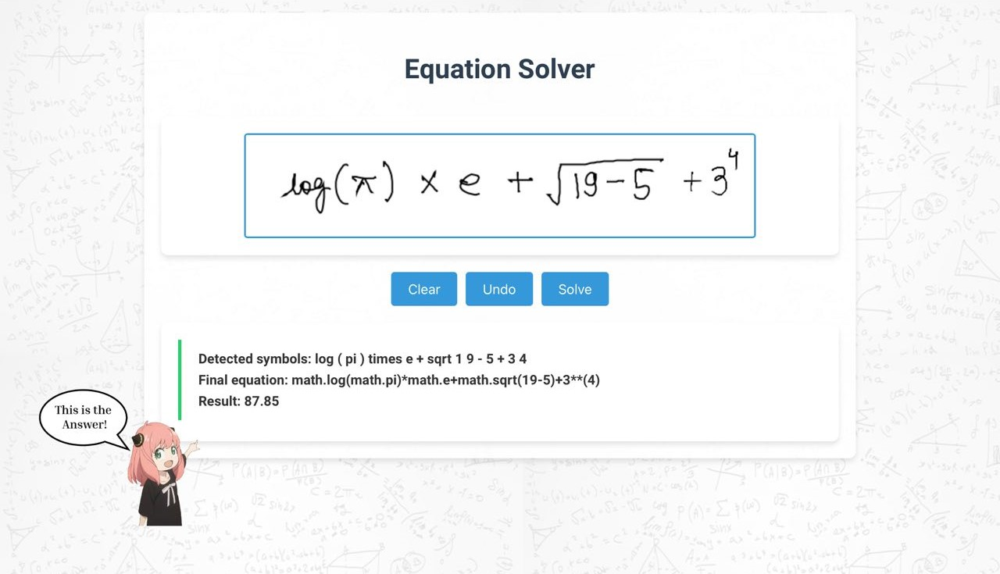

# Handwritten Equation Solver

This project is a web application that recognizes and solves handwritten mathematical equations. It leverages deep learning for image recognition, after recognizing the mathematical symbols , it uses a custom made class that coverts the recognized symbols into a mathematical equation , and returning the solution. Initially deployed on AWS, the app is now hosted on Render for cost-effective, free access.

## Features

* **Equation Recognition** : Detects and processes handwritten mathematical equations from uploaded images.
* **Digit and Symbol Recognition** : Identifies numbers and mathematical symbols using a custom-trained neural network.
* **Real-Time Calculation** : Solves equations by parsing recognized expressions and performing arithmetic operations.
* **Web Deployment** : Initially deployed on AWS, now hosted on Render for accessibility without cost concerns.

## Demo

You can access the app here: [Render Deployment Link](https://equation-solver-y5en.onrender.com)

## Screenshots

<div align="center">
  
</div>

*Web App Screenshot*

## Project Structure

* **Model Training** : Trained a CNN model for recognizing handwritten digits and symbols, fine-tuned for optimal accuracy.
  - Read more about the model and algorithm in [the blog.](https://anandsr724.github.io/blog/2024/solving_handwritten_equations_using_deep_learning/)
* **Backend Logic** : Includes digit and symbol recognition, a custom class for handing mathematical function such as sqrt, power, and function priority ,calculation, and error management.
* **Deployment** : Originally deployed on AWS for testing; now configured for Render to provide free, scalable hosting.

## Technologies Used

* **Deep Learning Framework** : TensorFlow/Keras
* **Backend** : Flask
* **Web Hosting** : Render (formerly on AWS)
* **Other Libraries** : OpenCV for image processing

## Installation

1. **Clone the repository**

   ```bash
   git clone https://github.com/anandsr724/Handwritten_Equation_Solver.git
   cd Handwritten_Equation_Solver
   ```
2. **Create a conda environment**

   ```bash
   conda create -n handwritten_solver python=3.8 -y
   conda activate handwritten_solver
   ```
3. **Install the requirements**

   ```bash
   pip install -r requirements.txt
   ```
4. **Run the app**

   ```bash
   python app.py
   ```
5. **Access the app**
   Open up `http://localhost:8080` in your web browser.

## MLflow

```bash
mlflow ui
```

- [Documentation](https://mlflow.org/docs/latest/index.html)

### DVC Commans

1. dvc init
2. dvc repro
3. dvc dag

## MLflow & DVC

MLflow

- Its Production Grade
- Trace all of your expriements
- Logging & taging your model

DVC

- Its very lite weight for POC only
- lite weight expriements tracker
- It can perform Orchestration (Creating Pipelines)

# AWS-CICD-Deployment-with-Github-Actions

1. Login to AWS console.
2. Create IAM user for deployment

   - With specific access

     1. EC2 access : It is virtual machine
     2. ECR: Elastic Container registry to save your docker image in aws
   - Description: About the deployment

     1. Build docker image of the source code
     2. Push your docker image to ECR
     3. Launch Your EC2
     4. Pull Your image from ECR in EC2
     5. Lauch your docker image in EC2
   - Policy:

     1. AmazonEC2ContainerRegistryFullAccess
     2. AmazonEC2FullAccess
3. Create ECR repo to store/save docker image
4. Create EC2 machine (Ubuntu)
5. Open EC2 and Install docker in EC2 Machine:

   ```bash
   #optinal
   sudo apt-get update -y
   sudo apt-get upgrade
   #required
   curl -fsSL https://get.docker.com -o get-docker.sh
   sudo sh get-docker.sh
   sudo usermod -aG docker ubuntu
   newgrp docker
   ```
6. Configure EC2 as self-hosted runner:
7. Setup github secrets:

   ```bash
   AWS_ACCESS_KEY_ID
   AWS_SECRET_ACCESS_KEY
   AWS_REGION  
   AWS_ECR_LOGIN_URI  
   ECR_REPOSITORY_NAME 
   ```

## Usage

1. **Upload an Image** : The user uploads an image containing a handwritten equation.
2. **Recognition and Solution** : The app recognizes the equation, performs the calculation, and returns the solution.
3. **Error Handling** : If the equation cannot be recognized or contains unsupported symbols, the app provides feedback for correction.

## Future Improvements

* **Expanded Symbol Recognition** : Support for additional mathematical operations and functions.
* **Improved UI/UX** : More user-friendly interface with enhanced visuals.
